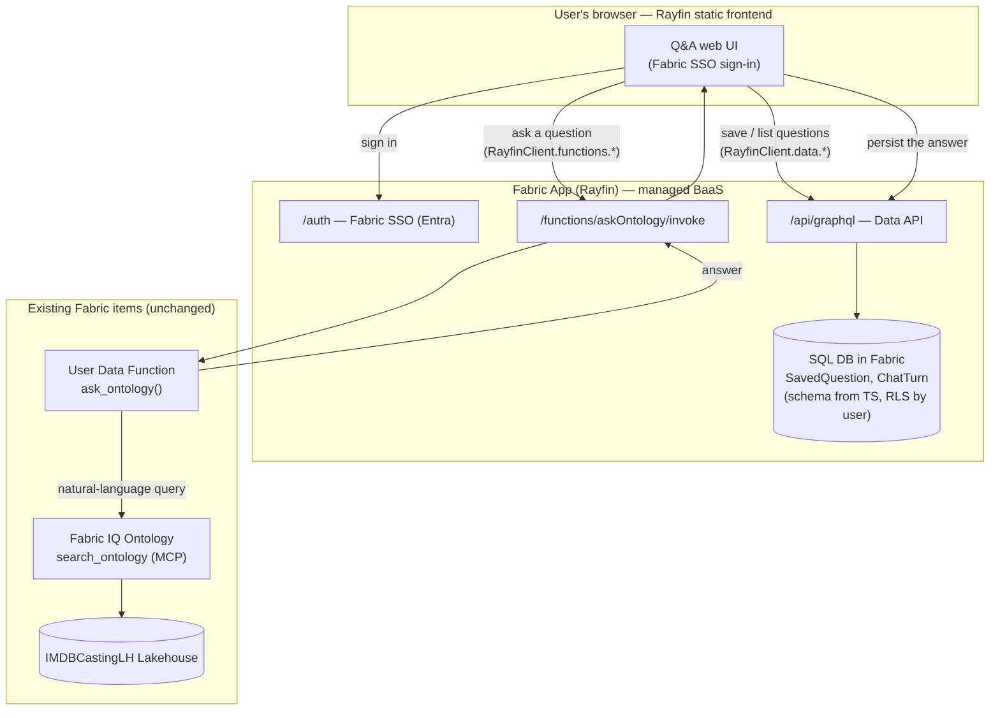

# Phase 4 — Rayfin (Fabric Apps) Integration Plan

> **Status: SCAFFOLDED & COMPILING (2026-06-05).** The `app/` folder now holds a
> working Rayfin app — data models, the typed `ask_ontology` functions surface,
> the Python UDF source, and the Q&A UI — that passes `tsc`, `vitest`, `vite
> build`, and `eslint`, and boots locally in mock mode. Remaining work is the
> Fabric portal/deploy steps (publish the UDF, grant Viewer, `rayfin up`). See
> `app/README.md` for the deploy runbook. The plan below is retained for context.
>
> Grounded in Microsoft Learn (`/fabric/apps/*`, June 2026 preview):
> Fabric Apps = code-first TS data models → generated **SQL DB + GraphQL API +
> Fabric SSO + static hosting**, deployed with the **Rayfin** CLI. Custom
> server-side logic is provided by **Fabric User Data Functions (UDF)**, invoked
> from the app via `client.functions.<name>.invoke()`.

---

## 1. How this layers over your current setup

Today you have (Phases 1–3):

- A **Fabric Lakehouse** (`IMDBCastingLH`) with 6 Delta tables.
- A published **Fabric IQ Ontology** over those tables (entities + relationships).
- The ontology's **MCP endpoint** (`.../ontologyEndpoint`), today consumed by
  GitHub Copilot CLI for natural-language Q&A via `search_ontology`.

Phase 4 adds a **governed web app** in front of that, **without moving or
duplicating the IMDB data**. The ontology stays the analytical brain; Rayfin
adds identity, a UI, and a small persistent-state DB for app concerns (saved
questions, chat history, favorites).



**Nothing about the Lakehouse or Ontology changes.** The only new Fabric items
are: (1) the Fabric App itself, and (2) one User Data Function that brokers the
ontology call.

---

## 2. Components & responsibilities

| Component | New? | Responsibility |
|---|---|---|
| **Rayfin frontend** (static, TS) | new | The Q&A UI. Signs the user in with Fabric SSO. Calls the data API for state and the function for answers. |
| **Rayfin SQL DB** (`SavedQuestion`, `ChatTurn`) | new | App state only — saved/favorited questions and per-user chat history. Schema generated from TS decorators; row-level security so each user sees only their own rows. **No IMDB data lives here.** |
| **Rayfin GraphQL `/api/graphql`** | new (auto) | CRUD over the two state entities, enforced by `@role` policies. |
| **User Data Function `ask_ontology`** | new | Server-side broker. Receives a question, calls the ontology `search_ontology` MCP tool, returns the NL answer. This is where the Fabric-audience token lives — never in the browser. |
| **Fabric IQ Ontology + MCP** | existing | Unchanged. The analytical engine. |
| **Lakehouse** | existing | Unchanged. |

### Why a User Data Function (and not call the ontology from the browser)

The browser only holds a Fabric SSO session scoped to *the Rayfin app*. It does
**not** have a token whose audience is `api.fabric.microsoft.com`, and we must
never embed a service token in the static frontend (it's served from a public
URL). The UDF is the server-side trust boundary that holds Fabric credentials
and reaches the ontology. Rayfin's client `functions` surface
(`client.functions.askOntology.invoke(...)`) is the supported way to call it.

---

## 3. Data model sketch (illustrative — not built yet)

```typescript
// rayfin/data/savedQuestion.ts
import { entity, role, uuid, text, bool, date } from '@microsoft/rayfin-core';

@entity()
@role('authenticated', '*', {
  policy: (claims, item) => claims.sub.eq(item.userId), // owner-only
})
export class SavedQuestion {
  @uuid() id!: string;
  @text({ min: 1, max: 500 }) question!: string;
  @bool() isFavorite!: boolean;
  @date() createdAt!: Date;
  @text() userId!: string; // = claims.sub
}

@entity()
@role('authenticated', '*', {
  policy: (claims, item) => claims.sub.eq(item.userId),
})
export class ChatTurn {
  @uuid() id!: string;
  @text() question!: string;
  @text() answer!: string;       // returned by ask_ontology
  @int() latencyMs!: number;     // for the demo's "watch it think" UX
  @date() createdAt!: Date;
  @text() userId!: string;
}
```

### `ask_ontology` User Data Function (pseudocode)

```python
# Fabric User Data Function (Python). Holds the Fabric credential; the browser never does.
def ask_ontology(question: str) -> dict:
    token = get_fabric_token()  # function's managed identity, audience api.fabric.microsoft.com
    resp = mcp_call(
        endpoint=ONTOLOGY_MCP_ENDPOINT,           # the same .../ontologyEndpoint URL
        tool="search_ontology",
        args={"naturalLanguageQuery": question, "naturalLanguageResponse": True},
        token=token,
    )
    return {"answer": resp.text, "raw": resp.json}
```

---

## 4. The one real decision: identity model for the ontology call

This is the only architectural choice that materially changes governance. Pick
one before we build:

| Option | How | Pros | Cons |
|---|---|---|---|
| **A. Service identity (recommended for the demo)** | The UDF uses its own managed identity, granted Viewer on the workspace/ontology. Every signed-in app user gets answers through that one identity. | Simplest; works today; no token-exchange plumbing. | All users effectively share the UDF's data access — must be disclosed as *app-level* access. Fine because the IMDB data is non-sensitive demo data. |
| **B. User-delegated (on-behalf-of)** | The UDF exchanges the caller's Entra token for an `api.fabric.microsoft.com` token (OBO) and calls the ontology *as the user*. | Preserves per-user Fabric governance end-to-end. | More plumbing; requires app registration + OBO scopes; only worth it if different users should see different ontology data. |

**Recommendation:** Option A for the demo (the dataset is public IMDB-derived
data; the value story is the *governed front door*, not per-row data
segregation). Note the tradeoff out loud in the talk track. Keep Option B as the
"how you'd harden this for sensitive data" slide.

Row-level security on the **Rayfin** state DB (saved questions / chat history)
is always per-user via `@role` + `claims.sub`, regardless of this choice.

---

## 5. Latency & reliability (carried over from measured limits)

- Cold capacity → first ontology call ~65s; warm ~10s; a degenerate traversal
  can run ~100s. So:
  - Set the function/HTTP timeout **> 120s**.
  - Frontend shows an explicit "thinking…" progress state and the measured
    `latencyMs`.
  - Pre-warm: a scheduled ping (or the existing keep-warm idea) before demos.
  - Prefer the **explicit-HAVING phrasing** guidance from Phase 3 in any
    canned/example questions surfaced in the UI.

---

## 6. Prerequisites (you, in the Fabric portal)

1. **Tenant admin** enables **Fabric Apps (preview)**: Admin portal → Tenant
   settings → *Fabric Apps (preview)* → Enabled (org or a security group).
2. The target **workspace has a capacity** assigned (your `fskust` F-SKU works;
   resume it if paused).
3. Node.js + npm locally to run the Rayfin CLI.
4. (For Option A) permission to create a **User Data Functions** item and grant
   its identity Viewer on the IMDB ontology workspace.

---

## 7. Proposed runbook (what we'd do once you approve)

> Review gate: we do **not** start until you confirm Section 4 (identity model)
> and the prerequisites in Section 6.

1. **Scaffold the app** (into a new top-level `app/` folder in this repo)
   `npm create @microsoft/rayfin@latest` → choose a TS template; name it e.g.
   `imdb-casting-app`.
2. **Define state models** — add `SavedQuestion` and `ChatTurn`
   (`app/rayfin/data/*.ts`) as in Section 3.
3. **Create the Python `ask_ontology` User Data Function** in the Fabric portal,
   pasting the ontology MCP endpoint URL and the `search_ontology` call. Grant
   its identity Viewer on the ontology workspace (Option A, confirmed).
4. **Wire auth** in `rayfin/rayfin.yml`: enable `auth` with `fabric.enabled:
   true` (SSO for deployed) and `password.enabled: true` (local dev only).
5. **Build the UI** — a question box, a "thinking" state, an answer panel, a
   "save/favorite" button, and a per-user history list (reads `ChatTurn`).
6. **Local run** — `npm run dev` against the Fabric backend; verify a question
   round-trips through the UDF to the ontology and back.
7. **Apply schema + deploy** — `npx rayfin up db apply` then `npx rayfin up`.
8. **Grant access** — give demo users **Run and interact** on the Fabric app.
9. **Smoke test** the deployed app URL (`https://<app>-app.rayfin.windows.net/`)
   with the Phase 3 verification prompts; confirm history persists per user.

---

## 8. What this demonstrates (talk track)

- **Two Build-2026 announcements in one story:** Fabric IQ Ontology (graph Q&A)
  + Fabric Apps / Rayfin (code-first BaaS) — composed, not bolted together.
- **Governed front door:** Fabric SSO + per-user RLS on saved state, while the
  ontology remains the single analytical source of truth (no data duplication).
- **Clean separation:** app state in Rayfin's SQL DB; analytics delegated to the
  ontology via a User Data Function — the supported extensibility seam.

---

## 9. Decisions — CONFIRMED (2026-06-04)

1. **Identity model → Option A, service identity.** The `ask_ontology` UDF calls
   the ontology as its own managed identity (granted Viewer on the ontology
   workspace). Disclosed as app-level access; fine for this public IMDB demo.
   Per-user RLS still applies to the Rayfin state DB.
2. **UDF language → Python.** Matches the existing notebooks and has the cleaner
   MCP/HTTP story.
3. **v1 UI scope → ask box + answer + per-user history/favorites + one-click
   "starter questions"** seeded from the Phase 3 verification prompts
   (`demo/REFINEMENT.md` §3).
4. **Repo placement → new `app/` folder in this repo** (keeps the demo
   self-contained; Rayfin scaffolds its own structure underneath).

> Next action when you say go: scaffold `app/` with
> `npm create @microsoft/rayfin@latest`, add the two state models, the Python
> `ask_ontology` UDF, and the starter-questions UI, following the runbook in §7.
